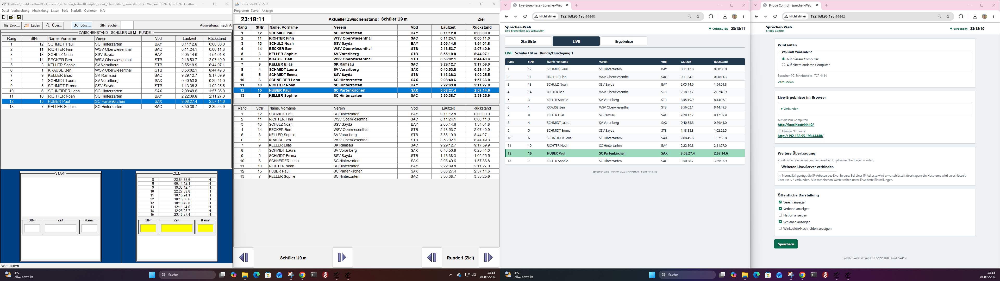

# Sprecher-Web

Sprecher-Web ist keine Web-Version der Wettkampfsoftware WinLaufen.
Das Projekt "Sprecher-Web" nutzt die von WinLaufen bereitgestellte **Sprecher-PC-Schnittstelle**
und stellt die dort gelieferten Live-Ergebnisdaten **zusätzlich zum "Sprecher-PC" 
webbasiert** bereit. **WinLaufen (http://www.winlaufen.de/)** ist eine Windows-Anwendung und läuft unabhängig von dieser Anwendung.

```text
WinLaufen
   |  Sprecher-PC-Schnittstelle / TCP 4444   (read-only, ausgehend)
   v
Bridge
   |  WebSocket / Ingest
   v
Live Server
   |  HTTP / WebSocket
   v
Browser
```



**Screenshot (01.09.2026): WinLaufen, Sprecher-PC, Sprecher-Web, Bridge Control**

Die beiden sichtbaren Oberflächen heißen:

- **Sprecher-Web – Bridge Control** — die Veranstalter-Oberfläche
- **Sprecher-Web – Live-Ergebnisse** — die Ansicht für alle Zuschauer

> **Status: Prototype Baseline, Entwicklungsversion**,
> kein Release, keine Freigabe. Für ausgewählte Vereine in **kontrollierten
> Netzen** gedacht, nicht für offenen Internetbetrieb. Vor dem Einsatz den
> Abschnitt [Known prototype security limitation](#known-prototype-security-limitation)
> lesen.

> 📖 **Sie wollen Sprecher-Web einsetzen?**
> Die vollständige Anleitung von der Installation bis zum Wettkampftag steht im
> **[Bedienerhandbuch](docs/BEDIENERHANDBUCH.md)**.

## Was Sprecher-Web kann

* Live-Ergebnisse, LIVE-Ansicht und Startlisten-Platzhalter in jedem Browser —
  Notebook, Tablet, Smartphone, ohne App und ohne Anmeldung.
* Verifiziert für **Lauf und Biathlon**. Tabellen, Uhr, Current Finish,
  Schießen und WinLaufen-Nachrichten werden ohne fachliche Korrektur
  transportiert.
* Der Veranstalter entscheidet in Bridge Control, welche Spalten öffentlich
  sichtbar sind (Verein, Verband, Nation, Schießen, Nachrichten).
* Ein Ausfall von Netzwerk, Live Server oder Bridge führt nie zu still
  veralteten Daten: Der Browser erkennt ihn, kennzeichnet die Anzeige und
  verbindet ohne Reload automatisch neu.
* Beliebig viele zusätzliche Live Server parallel — im LAN oder als temporärer
  Server im Internet.

WinSpringen, ein erfundenes Startlistenprotokoll, Datenbank und Broker bleiben
ausdrücklich außerhalb dieser Version.

## Empfohlene Betriebsweise

| Variante | Aufbau | Wann |
|---|---|---|
| **A — All-in-One** | alles auf einem Rechner, am einfachsten direkt auf dem WinLaufen-PC | der Normalfall |
| **B — anderer Rechner im LAN** | All-in-One oder Bridge only auf einem zweiten Rechner, Adresse des WinLaufen-PCs in Bridge Control | wenn der WinLaufen-PC frei bleiben soll |
| **C — zusätzlicher Server im Internet** | zusätzlich ein Presentation Node auf einem gemieteten Ubuntu-Server | wenn Zuschauer außerhalb des Veranstaltungsnetzes mitlesen sollen |

Variante C benötigt **keine Domain und kein TLS**: Für den bewusst einfachen,
temporären Selfhost-Betrieb genügt die öffentliche IPv4-Adresse, und in Bridge
Control wird im Normalfall nur diese eine Adresse eingetragen. Die verbindlichen
Grenzen dieses Betriebs stehen unten unter
[Known prototype security limitation](#known-prototype-security-limitation).

## Architektur in Kürze

| Baustein | Aufgabe |
|---|---|
| **`winlaufen-web-bridge`** | liest WinLaufen strikt read-only, hält den kanonischen Live-State, verteilt ihn an 0..n Ziele, stellt Bridge Control bereit |
| **`winlaufen-web-live-server`** | nimmt den Bridge-Ingest authentifiziert an, hält den veröffentlichten State, liefert die Live-Ergebnisse an Browser |
| `winlaufen-web-contract` | kleiner versionierter Snapshot-/ACK-Vertrag zwischen beiden |

Beide Runtimes sind getrennte Prozesse. Der Live Server enthält keinen
WinLaufen-Protokollcode. Auch die lokale Ansicht im All-in-One-Betrieb läuft
über eine echte ausgehende WebSocket-Verbindung der Bridge.

### Netzwerkvertrag

| Port | Richtung | Funktion |
|---|---|---|
| TCP 4444 | Bridge → WinLaufen-PC, **ausgehend** | WinLaufen Sprecher-PC-Quelle |
| TCP 44440 | eingehend | Live-Ergebnisse / HTTP Web Viewer |
| TCP 44441 | eingehend | Live WebSocket und Bridge-Ingest auf einem Listener |
| TCP 44442 | eingehend | Bridge Control |

**TCP 4444 ist keine eingehende Freigabe dieses Projekts.** Diesen Port stellt
WinLaufen selbst bereit, sobald dort die Sprecher-PC-Verbindung aktiviert wurde;
die Bridge verbindet sich nur ausgehend dorthin. 4444 gehört deshalb nicht in
die eingehenden Firewallregeln.

44440 und 44441 müssen für die vorgesehenen Zuschauergeräte erreichbar sein,
44442 nur für die vorgesehenen Administrationsgeräte.

## Schnellstart

> Vollständige Anleitung für Veranstalter:
> **[docs/BEDIENERHANDBUCH.md](docs/BEDIENERHANDBUCH.md)**

Voraussetzungen sind Git und JDK 25; Maven liefert der Maven Wrapper mit.
Fertige Releases zum Download gibt es noch nicht.

**Linux (Terminal)**

```sh
sudo apt install git openjdk-25-jdk
git clone https://github.com/richtertoralf/winlaufen-web.git
cd winlaufen-web
./mvnw clean package
sudo ./installer/linux/install.sh
```

**Windows 11 (Powershell)**

```powershell
winget install --id Git.Git --exact --source winget
winget install --id Microsoft.OpenJDK.25 --exact --source winget
# PowerShell neu öffnen, dann:
git clone https://github.com/richtertoralf/winlaufen-web.git
Set-Location winlaufen-web
.\mvnw.cmd clean package
```

Den **Installer** anschließend in einer **PowerShell mit Administratorrechten**
starten. Windows blockiert Skripte standardmäßig; deswegen das Folgende mit ausführen:

```powershell
Set-ExecutionPolicy -Scope Process -ExecutionPolicy Bypass
.\installer\windows\Install-WinLaufenWeb.ps1
```
***Zweck: Der Befehl `Set-ExecutionPolicy...` erlaubt das Ausführen von PowerShell-Skripten, die normalerweise durch Sicherheitsbeschränkungen blockiert würden.Temporär: Die Änderung gilt nur für das aktuelle PowerShell-Fenster. Sobald das Fenster geschlossen wird, ist die Sperre wieder aktiv.***


> **Vor Installation und Upgrade** eines Profils mit Bridge (All-in-One,
> Bridge only) in WinLaufen **Abwicklung → Sprecher-PC… → Trennen** wählen und
> danach wieder **Verbinden**. WinLaufen selbst muss nicht beendet werden.
> Details im [Bedienerhandbuch](docs/BEDIENERHANDBUCH.md#4-windows-all-in-one-installieren).

Danach Bridge Control unter `http://localhost:44442/` öffnen und die
Live-Ergebnisse unter `http://localhost:44440/`.

## Installationsprofile

Bei der Installation wird genau eine Sache ausgewählt: die Rolle des Rechners.
Adressen, Ziele und TLS gehören ausschließlich in die spätere Konfiguration
über Bridge Control.

| Profil | Installiert | Linux | Windows 11 |
|---|---|---|---|
| All-in-One | Bridge + Live Server | `--profile all-in-one` | `-Profile AllInOne` |
| Bridge only | nur Bridge | `--profile bridge-only` | `-Profile BridgeOnly` |
| Presentation Node | nur Live Server | `--profile presentation-node` | nicht unterstützt |

Unterstützt sind Debian, Ubuntu 24.04/26.04 und Raspberry Pi OS für alle drei
Profile sowie Windows 11 für All-in-One und Bridge only.

## Die angezeigte Wettkampfzeit

Die im Browser angezeigte Zeit ist die **Wettkampfzeit aus WinLaufen** — nicht
die Uhrzeit des WinLaufen-PCs, der Bridge, des Live Servers oder des Browsers.
Sprecher-Web reicht diesen Wert unverändert weiter und erzeugt keine eigene
laufende Uhr. Bleiben WinLaufen-Zeittelegramme aus, bleibt der zuletzt
gelieferte Wert stehen; er wird nie künstlich weitergezählt.

Damit ist die laufende Wettkampfzeit für den Sprecher ein sichtbares
Lebenszeichen der gesamten Kette vom WinLaufen-PC bis zur Anzeige. Erklärung
für Bediener: [Bedienerhandbuch, Kapitel 9](docs/BEDIENERHANDBUCH.md#9-die-angezeigte-wettkampfzeit).

## Dokumentation

**Für Veranstalter und Bediener**

| Dokument | Inhalt |
|---|---|
| [docs/BEDIENERHANDBUCH.md](docs/BEDIENERHANDBUCH.md) | **Start hier.** Installation, Einrichtung, Betrieb am Wettkampftag, Statusanzeigen, Störungshilfe |
| [docs/QUICKSTART_CLOUD.md](docs/QUICKSTART_CLOUD.md) | temporärer Live-Server auf einer Cloud-VM, Schritt für Schritt |

**Technische Dokumentation**

| Dokument | Inhalt |
|---|---|
| [docs/INSTALLATION.md](docs/INSTALLATION.md) | Installationsreferenz: Profile, Plattformen, Pfade, Dienste, Firewall, Deinstallation |
| [docs/DEVELOPMENT.md](docs/DEVELOPMENT.md) | Build, Entwicklungsbetrieb, Konfigurationsorte, Transportregel |
| [docs/SMOKE_TESTS.md](docs/SMOKE_TESTS.md) | manuelle Abnahmetests und protokollierte reale Nachweise |
| [docs/ARCHITECTURE.md](docs/ARCHITECTURE.md) | technischer IST-Stand der modularen Architektur |
| [docs/MODULAR_ARCHITECTURE.md](docs/MODULAR_ARCHITECTURE.md) | vollständige verbindliche Architekturentscheidungen |
| [docs/PRODUCT_SPEC.md](docs/PRODUCT_SPEC.md) | Produktspezifikation |
| [docs/WINLAUFEN_PROTOCOL.md](docs/WINLAUFEN_PROTOCOL.md) | WinLaufen-Protokoll und reale Evidenz |
| [docs/RELEASE.md](docs/RELEASE.md) | tag-basierter Release-Ablauf für Maintainer |

## Projektstatus

Entwicklungsversion `0.3.0-SNAPSHOT`. Kein Tag, kein Release, keine
Releasefreigabe.

### Real bestätigt

- Windows-11-All-in-One-Installation und -Upgrade aus dem Source Checkout
- reale WinLaufen-Kopplung; Verbinden und Trennen der Sprecher-PC-Schnittstelle
  wird korrekt erkannt
- Bridge und Live Server laufen dauerhaft als Dienst bzw. geplante Aufgabe
- Live-Ergebnisse und Bridge Control lokal und aus dem LAN
- Presentation Node auf einem Cloud-Server mit öffentlicher IPv4
- Live Server stop/start sowie kompletter Reboot des Presentation Node
- automatischer Browser-Reconnect ohne manuellen Reload
- Browser-Verbindung und WinLaufen-Quellenlage werden getrennt angezeigt
- Wettkampfzeit bleibt bei Ausfällen stehen und zeigt nach dem Reconnect exakt
  den neu gelieferten WinLaufen-Wert
- Bridge stop/start; der letzte Ergebnisstand bleibt auf dem Presentation Node
  erhalten, bis WinLaufen einen neuen Klassensnapshot liefert

Der Nachweis ist in [docs/SMOKE_TESTS.md](docs/SMOKE_TESTS.md) protokolliert.

### Noch offen

- endgültiges Windows-x64-Releasepaket mit gebündelter Runtime
- echte Fresh Installation ohne Git, Maven und JDK
- Linux-Releasepakete für AMD64 und ARM64
- vollständige Reboot-, Reinstall- und Profilwechsel-Abnahmen
- Richter-Projects-Pairing
- bekannte P2-/P3-Punkte aus den Reviews

### Bekannte technische Punkte für den nächsten Arbeitsblock

| Punkt | Auswirkung heute |
|---|---|
| Der `WinLaufenClient`-Test belegt lokal TCP 4444. | `./mvnw clean package` kann auf einem Rechner scheitern, auf dem WinLaufen mit aktiver Sprecher-PC-Verbindung läuft. Vor dem Bauen dort **Trennen** wählen. |
| Windows PowerShell 5.1 stellt Umlaute in Installerausgaben teils falsch dar (`Für`, `läuft`). | Nur die Anzeige ist betroffen; Installation und Konfiguration sind korrekt. |
| Ob Installation und Upgrade auch bei laufender und verbundener Sprecher-PC-Schnittstelle zuverlässig funktionieren, ist noch nicht geprüft. | Bis dahin gilt verbindlich: vorher **Trennen**, danach **Verbinden**. |

## Known prototype security limitation

**Diese Einschränkungen sind bekannt, bewusst akzeptiert und noch nicht behoben.**

### Bridge Control auf TCP 44442 hat keine Anmeldung

Diese Oberfläche besitzt bewusst keine Benutzer- oder Login-Authentifizierung.
Wer den Port erreicht, kann Bridge Control öffnen und die Konfiguration ändern —
WinLaufen-Quelle, Output Targets und die öffentliche Darstellung. Target-Secrets
gibt die Control-API nicht aus; das ersetzt jedoch keine Zugriffsbeschränkung.
44442 darf deshalb nur in einem vertrauenswürdigen LAN erreichbar sein: nicht im
Gäste-WLAN, nicht über unkontrollierte Portweiterleitungen, nicht direkt aus dem
Internet.

### Der Bridge-Ingest verwendet ein bekanntes Secret

Der Ingest des Live Servers ist authentifiziert, verwendet aber weiterhin ein
**bekanntes, im Quelltext und in dieser README stehendes Development-Secret**
(`local-development-secret`), solange `winlaufen.live.secret` nicht gesetzt ist.
Der Live Server bindet seinen WebSocket-Port standardmäßig auf `0.0.0.0`, und
auch der Installer erzeugt bewusst kein eigenes Secret.

**Jeder Teilnehmer, der den Ingest-WebSocket auf Port 44441 erreichen kann und
das bekannte Secret kennt, kann sich gegenüber dem Live Server als Bridge
ausgeben.** Er kann damit den kompletten veröffentlichten Stand ersetzen und
insbesondere fälschen:

- Wettkampfdaten und Wettkampfstruktur,
- die angezeigte Uhrzeit,
- Ergebnisse und Ranglisten,
- Klassenstände und Current-Finish-Markierung,
- öffentliche WinLaufen-Nachrichten.

Gefälschte Daten werden angenommen, bestätigt und sofort an **alle** verbundenen
Browser ausgeliefert. Die echte Bridge bemerkt das nicht.

### Verbindliche Einsatzgrenzen dieser Prototypversion

Es werden drei Betriebsarten unterschieden. Sie haben unterschiedliche Grenzen.

**1. Kontrolliertes LAN — der Normalfall**

- Einsatz in kontrollierten Vereins- bzw. Veranstaltungsnetzen.
- Bridge und Live Server sind nur im vertrauenswürdigen Netz erreichbar.
- Kein Betrieb in offenen Gäste-WLANs oder gemeinsam genutzten Netzen.
- **Keine Portweiterleitung** der LAN-Installation ins öffentliche Internet.
- Die Windows-Firewallregeln bleiben bewusst auf Private und Domain beschränkt.

**2. Temporärer Selfhost-Presentation-Node mit öffentlicher IPv4**

Ein Verein mietet für einige Stunden eine Cloud-VM, installiert dort das Profil
Presentation Node und verbindet die eigene Bridge über die öffentliche
IP-Adresse. Das ist ausdrücklich vorgesehen — siehe
[docs/QUICKSTART_CLOUD.md](docs/QUICKSTART_CLOUD.md) — und unterliegt diesen
Grenzen:

- Öffentlich freigegeben werden **nur** TCP 44440 (Web View) und TCP 44441
  (Bridge-Ingest) **des gemieteten Nodes**.
- **TCP 44442 gehört dort nicht hin.** Bridge Control hat keine Anmeldung und
  darf niemals öffentlich erreichbar sein — weder auf dem Node noch über eine
  Portweiterleitung zur Bridge im Vereinsnetz.
- Die Bridge im Vereinsnetz bleibt unverändert unerreichbar von außen; sie
  verbindet ausgehend.
- Die Übertragung ist **unverschlüsselt**. Mitgelesen werden können deshalb
  sowohl die übertragenen Daten als auch der **Verbindungsschlüssel**.
- Wer den Verbindungsschlüssel kennt oder mitliest und 44441 erreicht, kann
  unerwünschte Daten einspeisen und damit den kompletten veröffentlichten Stand
  ersetzen (siehe oben). Solange der bekannte Standardschlüssel aktiv ist,
  genügt dafür die Kenntnis der IP-Adresse.
- Für einen temporären Selfhost-/Testserver ist dieser bewusst einfache Betrieb
  vertretbar. Für einen dauerhaften oder zentral betriebenen Dienst ist
  verschlüsselte Übertragung vorgesehen (siehe Punkt 3).
- Deshalb: nur für die Dauer der Veranstaltung betreiben, danach die VM
  **abschalten oder löschen**, und wo möglich `winlaufen.live.secret` auf dem
  Node und den Verbindungsschlüssel des Targets in Bridge Control auf einen
  eigenen Wert setzen.
- Keine Eignung für Anmeldungen, personenbezogene Daten oder alles, was über
  die ohnehin öffentlich angezeigten Wettkampfdaten hinausgeht.

**3. Dauerhafter abgesicherter WAN-Betrieb**

Für produktiven Dauerbetrieb über WAN oder eine Anbindung an Richter-Projects
sind **WSS mit gültigem Zertifikat sowie individuell provisionierte Secrets pro
Target** erforderlich. Das ist bewusst nicht Teil dieser Prototype Baseline und
bleibt ein offenes Production-Hardening-Thema.

Der Live Server weist beim Start ausdrücklich auf das aktive Default-Secret hin.

## Technische Namen

Sichtbar heißt das Produkt **Sprecher-Web**. Der Name lehnt sich bewusst an
den etablierten WinLaufen-„Sprecher-PC" an. Die öffentliche Oberfläche trägt den
Untertitel **Live-Ergebnisse aus WinLaufen** — das beschreibt die Herkunft der
angezeigten Daten. Die Browsertitel lauten **Live-Ergebnisse · Sprecher-Web**
und **Bridge Control · Sprecher-Web**.

Technische Bezeichner bleiben aus Kompatibilitätsgründen zunächst unverändert,
damit bestehende Befehle, Upgrade-Pfade und Deinstallationen weiter
funktionieren:

- Maven-Artefakte und JARs `winlaufen-web-*`
- Java-Packages `de.winlaufen.web.*`
- Installationspfade `/opt/winlaufen-web`, `/etc/winlaufen-web`,
  `C:\Program Files\WinLaufen Web`
- systemd-Units `winlaufen-bridge.service`, `winlaufen-live-server.service`
- geplante Aufgaben `WinLaufen Web Bridge`, `WinLaufen Web Live Server`
- Firewall-Regel-IDs `WinLaufenWeb-*`

## Lizenz

Sprecher-Web steht unter der [GNU Affero General Public License
v3.0](LICENSE) (AGPL-3.0). Kurz gefasst: Der Quellcode ist frei nutzbar,
veränderbar und weitergebbar. Wer eine veränderte Version über ein Netzwerk
zugänglich macht — auch als gehosteten Dienst, ohne den Code selbst
weiterzugeben — muss den vollständigen, veränderten Quellcode ebenfalls
unter der AGPL-3.0 verfügbar machen (§13 der Lizenz).

Für Sportvereine, die die Software unverändert oder mit eigenen Anpassungen
ausschließlich für ihre eigene Veranstaltung betreiben, entstehen daraus
keine Pflichten — die Offenlegungspflicht greift erst, wenn Dritte über ein
Netzwerk auf eine veränderte Version zugreifen können.
