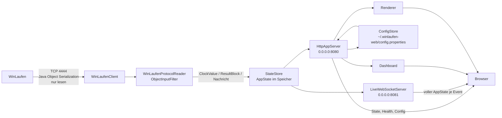
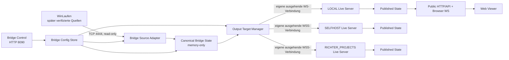

# Modulare Zielarchitektur: Bridge, Live Server und Web Viewer

Status: implementierte und weiterhin verbindliche Architektur. Der
Refactoring-Block auf Basis des Checkpoints `6481a3b` hat die hier festgelegten
Modul-, Prozess-, State-, Transport- und Konfigurationsgrenzen umgesetzt.

## 1. Scope

Dieses Review trennt die bestehende Anwendung in drei fachliche Ebenen und zwei
unabhängig installierbare Java-Runtimes:

1. **Bridge**: liest proprietäre Quellen und erzeugt den kanonischen Live-State.
2. **Live Server**: nimmt unseren Vertrag entgegen und veröffentlicht den State.
3. **Web Viewer**: zeigt ausschließlich die öffentliche Live-Server-Sicht an.

Die vorhandene WinLaufen-Semantik bleibt unverändert. Insbesondere bleiben
TCP/4444 read-only, Java-Serialisierungsreferenzen, ObjectInputFilter,
Clock-/Heartbeat-Regeln, vollständige Klassensnapshots, dynamische Header,
Current Finish, Biathlon-Schießen und Nachrichten erhalten. Dieses Zielbild
führt keine WinSpringen- oder Startlisten-Protokollannahmen ein.

Persönliche Browseroptionen, Remote-Output-Produkte, eine Datenbank, Broker und
komplexe PKI sind nicht Teil dieses Refactorings. SELFHOST und
RICHTER_PROJECTS erhalten zunächst denselben technischen Zielvertrag; ihre
produktive Bereitstellung und Betriebsdetails bleiben gesonderte Arbeit.

## 2. Begriffe

### Bridge

Das Backend beim Veranstalter bzw. an der Zeitnahme. Nur die Bridge kennt
WinLaufen oder künftig andere proprietäre Quellsysteme. Sie besitzt die einzige
Veranstalter-Konfiguration, den kanonischen State und 0..n unabhängige
Output-Verbindungen.

### Live Server

Das unabhängig betreibbare Backend für lokale, LAN- oder öffentliche
Verteilung. Es kennt ausschließlich den eigenen Bridge-Live-Server-Vertrag,
hält den zuletzt akzeptierten veröffentlichten State und bedient Browser über
HTTP und WebSocket.

### Web Viewer

Das vom Live Server ausgelieferte Browser-Frontend aus HTML, CSS und JavaScript.
Der bisherige Architekturbegriff „Renderer“ wird durch „Web Viewer“ ersetzt.
Bestehende `/renderer`-URLs dürfen während der Migration als Redirect oder
Kompatibilitätsroute weiterbestehen, sind aber keine Modulgrenze.

### Bridge Control

Die einzige Veranstalter-Oberfläche. Sie gehört zur Bridge und konfiguriert
Quelle, Output Targets und Presentation Config. Sie ist nicht der Web Viewer
und keine Live-Server-Administration.

## 3. Frühere monolithische IST-Architektur

Der Stand vor dem modularen Refactoring war ein Maven-Modul, ein Shade-JAR und
ein Java-Prozess.
`de.winlaufen.web.Main` erzeugt alle Komponenten und besitzt ihren gemeinsamen
Lifecycle.



Prozess- und Modulgrenzen im IST:

- ein Prozess: `de.winlaufen.web.Main`;
- ein Maven-Artefakt: `winlaufen-web.jar`;
- eine Java-Package-Wurzel mit config, protocol, model, state, json und web;
- statische Dashboard- und Renderer-Ressourcen im selben Klassenpfad;
- HTTP 8080 und Browser-WebSocket 8081 sind zwingende Startbestandteile;
- WinLaufen TCP 4444 ist eine ausgehende Verbindung des gleichen Prozesses.

Lifecycle im IST:

1. `Main` lädt `AppConfig` und erstellt genau einen `StateStore`.
2. `Main` erstellt `WinLaufenClient`, `LiveWebSocketServer` und
   `HttpAppServer` mit demselben Store.
3. HTTP und WebSocket müssen erfolgreich binden; erst danach startet der
   WinLaufen-Client.
4. Eine Hoständerung aus dem Dashboard ruft unmittelbar
   `WinLaufenClient.reconnectTo` auf.
5. Beim Shutdown werden HTTP, WinLaufen-Client und WebSocket im selben Prozess
   beendet.

Damit gibt es im IST keine Netzwerk- oder Installationsgrenze zwischen Bridge
und öffentlicher Verteilung.

## 4. Frühere IST-Abhängigkeiten

### Fachliche Zuordnung der vorhandenen Teile

| Vorhandener Teil | IST-Abhängigkeiten | Fachliche Zielzuordnung |
|---|---|---|
| `Main` | config, state, protocol, HTTP, WebSocket | teilen in `BridgeMain` und `LiveServerMain` |
| `AppConfig`, `ConfigStore` | Quelle, exklusiver OutputMode, beide Webports, PublicDisplayConfig | Bridge; technische Live-Server-Ports auslagern |
| `PublicDisplayConfig` | von AppConfig und Browser-JSON verwendet | Contract als `PresentationConfig`; Eigentümer Bridge |
| `OutputMode` | genau ein ausgewählter Wert mit statischem `enabled` | ersetzen durch Bridge-`OutputTargetConfig`-Liste und Typenum |
| `ClockValue`, `Heartbeat`, `ResultBlock` | WinLaufen-Wire-Semantik | nur Bridge/WinLaufen-Adapter |
| `WinLaufenClient`, `WinLaufenProtocolReader`, `WinLaufenObjectFilter` | AppConfig-Port, StateStore | nur Bridge/WinLaufen-Adapter |
| `AppState`, `Competition`, `CompetitionClass`, `ClassSnapshot`, `CurrentFinish`, `ConnectionHealth` | Store, JSON, Webserver, Tests | kanonische Contract-DTOs; `ConnectionHealth` eindeutig als Source Health benennen |
| `StateStore` | nimmt direkt `ResultBlock` aus protocol an und publiziert StateEvent | teilen: Bridge-State-Aufbau und Live-Server-Published-State-Store |
| `StateEvent` | AppState plus browserorientierter Eventtyp | nicht über Modulgrenze übernehmen; v0.1 Bridge-Vertrag nutzt Vollsnapshot |
| `Json` | serialisiert State **und** Bridge-Konfiguration/OutputMode | teilen in Contract-Codec, Live-Server-Public-JSON und Bridge-Control-JSON |
| `HttpAppServer` | StateStore, ConfigStore, AppConfig, OutputMode, Dashboard, Renderer | teilen in Bridge-Control-HTTP und Live-Server-HTTP |
| `LiveWebSocketServer` | direkt am Bridge-StateStore; Browser-Origin | Live Server, gespeist aus Published-State-Store |
| `OriginPolicy` | HTTP-/WS-Hostmodell | Live Server für Browser; Bridge Control erhält eigene Same-Origin-Regel |
| `dashboard.html/js` | Source-State, Quelle, OutputMode, Presentation, Renderer-Link | Bridge Control |
| `renderer.html/js` | State API, Config API, Browser-WebSocket | Web Viewer im Live-Server-Artefakt |
| `app.css` | Regeln für Dashboard und Renderer gemeinsam | bei Migration in Bridge-Control- und Viewer-CSS teilen, nicht runtime-übergreifend koppeln |

### Tatsächliches Abhängigkeitsbild

```text
Main
 ├─ ConfigStore ── AppConfig ── OutputMode
 │                    └──────── PublicDisplayConfig
 ├─ WinLaufenClient ── StateStore
 │   ├─ AppConfig.WINLAUFEN_PORT
 │   ├─ Heartbeat / ProtocolReader / ObjectFilter
 │   └─ ResultBlock ────────────┐
 ├─ HttpAppServer               │
 │   ├─ StateStore <────────────┘
 │   ├─ ConfigStore / AppConfig / OutputMode / PublicDisplayConfig
 │   ├─ Json
 │   └─ Dashboard + Renderer + gemeinsame Assets
 └─ LiveWebSocketServer
     ├─ StateStore / StateEvent
     ├─ Json
     └─ OriginPolicy

StateStore
 ├─ kennt Bridge-internes ResultBlock
 └─ erzeugt browserseitig veröffentlichtes AppState und StateEvent zugleich
```

### Direkte Kopplungen, die getrennte Installation verhindern

1. `Main` konstruiert und stoppt Quelle und Webserver gemeinsam.
2. `HttpAppServer` ist gleichzeitig Bridge-Control-Server, öffentliche
   Live-Server-API und Static-File-Server für den Web Viewer.
3. `LiveWebSocketServer` hört direkt auf dem von WinLaufen gespeisten
   `StateStore`; ein Bridge-Live-Server-Vertrag existiert nicht.
4. `StateStore.result(ResultBlock)` koppelt kanonischen State-Aufbau unmittelbar
   an einen WinLaufen-spezifischen Transporttyp.
5. `Json` kennt sowohl öffentlichen Wettkampf-State als auch die komplette
   Bridge-Konfiguration einschließlich `OutputMode` und Ports.
6. Ein einziges `AppConfig` mischt Quelle, Veranstalter-Präsentation,
   exklusives Output-Modell und Server-Deploymentparameter.
7. Das eine Shade-JAR enthält Java-WebSocket-Server, WinLaufen-Protokollcode,
   Dashboard und Viewer; weder Seite ist separat installierbar.

### Direkter Browserzugriff auf Bridge-State und -Konfiguration

- `dashboard.js` liest `/api/v1/config` und `/api/v1/state` und verbindet sich
  auf den dort publizierten WebSocket-Port.
- `renderer.js` liest ebenfalls **beide** Endpunkte. Damit liest der öffentliche
  Browser heute `AppConfig`, obwohl er nur Presentation Config und den
  Live-Server-Endpunkt benötigt.
- Beide Browseroberflächen empfangen Events direkt aus dem Bridge-`StateStore`.
- Der Viewer-Link zeigt auf denselben HTTP-Prozess; sein Logo-Link führt zurück
  zur Bridge-Konfiguration.

### Verantwortung im falschen Layer

- öffentliche HTTP-State-API, Browser-WebSocket und Viewer-Auslieferung liegen
  heute im Bridge-Prozess; sie gehören zum Live Server;
- der öffentliche Viewer bezieht Presentation Config aus der vollständigen
  Bridge-Config-API; der Live Server muss stattdessen die von der Bridge
  publizierte Presentation Config halten;
- `StateEvent` ist gleichzeitig internes Store-Ereignis und Browser-Wireformat;
- HTTP-/WebSocket-Ports des öffentlichen Servers liegen in der
  Veranstalterkonfiguration;
- der exklusive `OutputMode` modelliert eine Auswahl, obwohl Outputs ein Fan-out
  sind.

### Wiederverwendung, Verschieben und Teilen

Nahezu unverändert übernehmbar sind:

- `ClockValue`, `Heartbeat`, `WinLaufenProtocolReader` und
  `WinLaufenObjectFilter` im Bridge-Modul;
- der Verbindungs- und Reconnect-Kern von `WinLaufenClient`;
- die fachlichen State-Felder und deren unveränderte Wirewerte;
- `LiveWebSocketServer`-Mechanismen für Initialsnapshot, mehrere Clients,
  Revisionsschutz, Originprüfung und sofortigen Rebind, nach Wechsel auf den
  Published-State-Store;
- die Web-Viewer-Ansichten und dynamische Headerprojektion;
- der Startlisten-Platzhalter und die vorhandenen Protokollfixtures.

Verschoben oder geteilt werden müssen:

- `Main`, `AppConfig`, `StateStore`, `Json`, `HttpAppServer`, Browserressourcen
  und Tests;
- Dashboard wird Bridge Control; Renderer-Ressourcen werden Web Viewer;
- der Source-State-Aufbau wird von der Live-Server-State-Annahme getrennt;
- Browser-API und Bridge-Control-API werden separate Verträge.

Ausdrücklich nicht duplizieren:

- kanonische State-DTOs, Presentation-DTO und Bridge-Live-Server-Wirevertrag;
- JSON-Felddefinitionen und Versionsprüfung des internen Vertrags;
- WinLaufen-Protokollparser oder ObjectInputFilter im Live Server;
- Wettkampflogik in Output-Adaptern;
- Viewer-Dateien pro Output-Typ;
- separate LOCAL-State- oder LOCAL-Transportlogik.

## 5. Behobene Probleme des früheren IST

Der Monolith erfüllt die lokale v0.1-Funktion, bildet das neue Produktziel aber
nicht ab:

- Quelle und Veröffentlichung haben dieselbe Prozessausfallgrenze.
- Der Start scheitert vollständig, wenn einer der öffentlichen Ports belegt ist.
- Es gibt nur einen exklusiven `OutputMode`, keine Target-Instanzen und keine
  unabhängigen Zielzustände.
- Ein langsamer oder defekter zukünftiger Output ließe sich nicht sauber vom
  Source-Client isolieren; es existiert nur die browserbezogene globale
  Publisher-Queue.
- Nach einem externen Reconnect gibt es keinen Bridge-Live-Server-Resync, weil
  diese Verbindung noch nicht existiert.
- Der Live Server kann nicht ohne WinLaufen-Klassen installiert werden.
- Presentation Config ist korrekt als Veranstaltervorgabe vorhanden, erreicht
  Browser aber über die falsche Grenze.
- „Renderer“ bezeichnet zugleich Ressource, Route und Architekturrolle und
  verdeckt die eigenständige Viewer-Ebene.

Bestehende Dokumentationsaussagen, die bewusst geändert werden:

| Bisherige Aussage | Zielaussage |
|---|---|
| Bridge stellt HTTP, WebSocket, Dashboard und Renderer bereit | Bridge stellt nur Bridge Control bereit; Live Server stellt Public API, Browser-WebSocket und Web Viewer bereit |
| genau ein `OutputMode` | 0..n `OutputTargetConfig`-Instanzen, auch mehrere gleichen Typs |
| Browser verbindet sich direkt zum Bridge-Host | Web Viewer verbindet sich ausschließlich zu seinem Live Server |
| `http://<bridge-host>:8080` und `ws://<bridge-host>:8081` sind öffentliche Endpunkte | diese Ports gehören standardmäßig zum Live Server; Bridge Control erhält einen eigenen Port |
| normalisierter State speist direkt HTTP/WebSocket | kanonischer Bridge-State wird erst über den versionierten Vertrag zum Published Live Server State |
| lokale Ausgabe ist Sonderfunktion des Monolithen | LOCAL ist ein normales Output Target zum lokal laufenden Live Server |

Die bisherigen Dokumente werden nicht als historische Beschreibung gelöscht.
`docs/ARCHITECTURE.md` beschreibt nun den modularen IST-Stand und verweist für
die vollständigen verbindlichen Entscheidungen auf dieses Dokument.
`docs/PRODUCT_SPEC.md` und README verwenden ebenfalls die implementierten
Runtime- und Modulgrenzen.

## 6. Implementierte modulare Architektur



Verbindliche Regeln:

- Nur Source Adapter kennen proprietäre Protokolle.
- Der kanonische Bridge-State ist outputneutral.
- Jeder konfigurierte Output besitzt Adapterinstanz, Worker, Verbindungszustand,
  Retry und Resync unabhängig von allen anderen Outputs.
- Der Live Server importiert nur das Contract-Modul, nie das Bridge-Modul.
- Der Web Viewer wird nur vom Live Server ausgeliefert und kennt nur dessen
  öffentliche API.
- LOCAL verwendet exakt denselben Output-Adapter und Vertrag wie ein entferntes
  Ziel. Lediglich Endpoint, TLS-Policy und Credentials sind Konfiguration.

## 7. Prozess- und Installationsgrenzen

Es entstehen mindestens zwei ausführbare Runtime-Artefakte:

- `winlaufen-web-bridge`: Source Adapter, Canonical State, Fan-out, Bridge
  Config Store und Bridge Control;
- `winlaufen-web-live-server`: Contract-Empfang, Published State, Public API,
  Browser-WebSocket und statischer Web Viewer.

`winlaufen-web-contract` ist eine kleine Bibliothek, kein Prozess. Ein
All-in-One-Installer darf beide Runtimes und eine abgestimmte lokale
Konfiguration installieren, startet aber zwei Prozesse. Es gibt keinen
In-Process-Kurzschluss und keinen gemeinsamen Store.

Unterstützte Installationen:

```text
Bridge allein:
  winlaufen-web-bridge

Live Server + Web Viewer allein:
  winlaufen-web-live-server

All-in-One:
  winlaufen-web-bridge process --WS--> winlaufen-web-live-server process
```

Der Live Server muss auf seinem Runtime-Classpath weder
`java.io.ObjectInputStream`-basierte Adapter noch WinLaufen-Protokollklassen
benötigen. Umgekehrt benötigt eine reine Bridge-Installation keine
Viewer-Ressourcen und keinen öffentlichen Browser-WebSocket-Server.

### Ports im SOLL

| Verbindung | Default/Empfehlung | Besitzer |
|---|---|---|
| WinLaufen TCP | Zielport 4444, fest | Quelle; Bridge verbindet ausgehend |
| Bridge Control HTTP | `127.0.0.1:8090` | Bridge |
| Live Server Public HTTP | `0.0.0.0:8080` | Live Server |
| Live Server WebSocket | `0.0.0.0:8081` | Live Server |

Bridge Control benötigt keinen öffentlich erreichbaren Port. Default ist nur
Loopback. Für Bedienung von einem anderen Veranstaltergerät darf die technische
Bridge-Konfiguration bewusst eine LAN-Bind-Adresse setzen; dies ist keine
Voraussetzung für den Datenfluss. Der Live Server verwendet Port 8081 sowohl
für Browser-WebSockets als auch, über getrennte Pfade und Handshake-Regeln, für
Bridge-Ingestion. Damit kommen gegenüber heute nur der lokale Bridge-Control-
Port und keine weiteren öffentlichen Ports hinzu.

Empfohlene Pfade:

- Bridge Control: `http://localhost:8090/`
- Web Viewer: `http://<live-server>:8080/`
- Public State: `GET http://<live-server>:8080/api/v1/state`
- Browser live: `ws://<live-server>:8081/live/v1`
- Bridge ingest: `ws://<live-server>:8081/bridge/v1/channels/<channel-id>`;
  über Internet zwingend `wss://...` (typischer externer Port 443).

## 8. State Ownership

| Ebene | Autoritativer Owner | Kopie/Revision | Persistenz | Neustart und Resync |
|---|---|---|---|---|
| A. Source State | WinLaufen bzw. verifizierte Quelle | Wirewerte und Reihenfolge sind allein maßgeblich | Quelle entscheidet | Bridge eröffnet neue Source-Verbindung und neue Deserialisierungskontexte |
| B. Canonical Bridge State | Bridge | immutable State; `sourceRevision` steigt pro Bridge-Stream | memory-only | startet leer; neue `streamId`; Quelle füllt ihn wieder; letzte Werte werden nie aus lokaler Uhr rekonstruiert |
| C. Published Live Server State | je Live-Server-Channel der Live Server | Kopie des zuletzt akzeptierten vollständigen Bridge-Snapshots; eigene `publicationRevision` für Browser | memory-only in v0.1 | startet leer; Bridge-Verbindung liefert sofort Vollsnapshot; bleibt bei Ausfall als stale/disconnected markierte letzte Kopie sichtbar |
| D. Browser State | jeweiliger Browser | flüchtige Kopie des letzten Live-Server-Snapshots; Revisionsschutz pro Verbindung | keine Serverpersistenz; optionaler Browser-UI-State out of scope | WebSocket-Reconnect erhält sofort autoritativen Vollsnapshot |

`sourceRevision` ist monoton innerhalb einer `streamId`. Bei jedem
Bridge-Prozessstart wird eine neue zufällige `streamId` erzeugt; dadurch ist ein
Revision-Neustart eindeutig. Der Live Server vergibt zusätzlich eine innerhalb
seiner Prozesslaufzeit monoton steigende `publicationRevision`, die die heutige
Browser-Revisionsgarantie fortführt. Ein Target-ACK referenziert
`streamId/sourceRevision`; Browser sehen `publicationRevision`.

Presentation Config ist Bestandteil jedes vollständigen Bridge-Snapshots. Der
Published State besteht daher aus Competition State **und** der dazu atomar
veröffentlichten Presentation Config. Output-Runtime-Health gehört nicht in den
kanonischen Wettkampf-State; er bleibt Bridge-Telemetrie.

State wird in v0.1 nicht auf Platte persistiert. Nach Neustart zeigt eine
Komponente keinen vermeintlich aktuellen alten Wettkampfstand aus einer Datei.

## 9. Bridge → Live Server Contract

### Modul und Versionierung

`winlaufen-web-contract` enthält ausschließlich:

- immutable DTOs für kanonischen Competition State und Presentation Config;
- Envelopes und ACKs des Bridge-Live-Server-Vertrags;
- zentrale JSON-Codec- und strikte Validierungsregeln für diesen Vertrag;
- `schemaVersion = 1` und kompatibilitätsrelevante Limits.

Es enthält keine Source Adapter, Sockets, Retrylogik, Stores, HTTP-Handler,
Browsermodelle oder Output-spezifische Implementierung. Eine kleine, etablierte
JSON-Bibliothek ist hier gerechtfertigt, weil der Live Server erstmals
untrusted JSON sicher **lesen** muss; ein zweiter handgeschriebener Parser oder
duplizierte Serializer wären riskanter. Die konkrete Bibliothek wird im
Refactoring auf genau Contract-Codec-Nutzung begrenzt.

### V1-Nachricht

Für v0.1 sendet die Bridge bei **jeder** kanonischen Revision einen vollständigen
autoritativen Snapshot. Das entspricht dem heutigen Verhalten, bei dem auch
Browser-Events den gesamten `AppState` tragen, und vermeidet Delta-Zustand im
Output. Optimierungen können später additive Nachrichtentypen ergänzen, dürfen
den verpflichtenden Resync-Snapshot aber nicht ersetzen.

Normative Form (Feldnamen verbindlich, Beispielwerte illustrativ):

```json
{
  "type": "snapshot",
  "schemaVersion": 1,
  "channelId": "event-2026",
  "streamId": "550e8400-e29b-41d4-a716-446655440000",
  "sourceRevision": 42,
  "state": {
    "sourceHealth": "CONNECTED",
    "clock": "99:99:99",
    "competition": {
      "type": "Standardwettkampf",
      "evaluationMode": 1,
      "classCount": 2,
      "winSpringenPosition": 0,
      "roundOrHeat": 0,
      "classes": [
        {
          "index": 0,
          "name": "U13 m",
          "roundsOrTeamSize": 0,
          "snapshot": {
            "sourceRevision": 41,
            "headers": ["Rang", "StNr"],
            "rows": [["1", "101"]]
          }
        }
      ]
    },
    "currentFinish": {
      "classIndex": 0,
      "rowIndex": 0,
      "snapshotSourceRevision": 41
    },
    "message": "Start verschiebt sich"
  },
  "presentation": {
    "showClub": true,
    "showAssociation": true,
    "showNation": false,
    "showShooting": true,
    "showPublicMessages": false
  }
}
```

Null ist für noch nicht empfangene `clock`, `competition`, `currentFinish` und
`message` zulässig. Header, Zellen, Reihenfolge, Indizes, Clock und Nachrichten
werden ohne fachliche Korrektur übertragen. Strukturelle Größenlimits gelten
auch hier.

Der Live Server antwortet nach atomarer Annahme:

```json
{
  "type": "ack",
  "schemaVersion": 1,
  "channelId": "event-2026",
  "streamId": "550e8400-e29b-41d4-a716-446655440000",
  "sourceRevision": 42
}
```

Verhalten:

- Nach erfolgreichem WebSocket-Handshake sendet die Bridge immer sofort ihren
  kompletten aktuellen Snapshot, auch wenn seit dem Disconnect nichts änderte.
- Innerhalb derselben `streamId` lehnt der Live Server niedrigere Revisionen ab
  und darf gleiche Revisionen idempotent bestätigen.
- Eine neue authentifizierte `streamId` beginnt einen neuen Bridge-Stream und
  darf bei Revision 0 beginnen.
- Ein Snapshot ersetzt den kompletten Published State des Channels atomar.
- ACK bedeutet „validiert und im Published-State-Store übernommen“, nicht nur
  „TCP-Bytes empfangen“.
- Schema-Versionen werden explizit geprüft; unbekannte Majorversionen führen zu
  einer klaren Protokollschließung, nicht zu stiller Teilinterpretation.

## 10. Transportentscheidung

### Vergleich

| Kandidat | Vorteil | Nachteil | Entscheidung |
|---|---|---|---|
| HTTP Push (`POST` pro Snapshot) | sehr einfach, gut durch Proxies | eigenes Retry/ACK je Request; häufige Clock-Updates erzeugen neue Requests; Liveness weniger direkt | nicht gewählt |
| HTTP + separates WebSocket | flexible Zusatz-API | zwei Mechanismen für einen kleinen Bridge-Vertrag | nicht gewählt |
| SSE | gut für Server→Client | falsche Hauptrichtung; Bridge→Server benötigt zusätzlich HTTP | nicht gewählt |
| WebSocket-only | dauerhafte ausgehende Bridge-Verbindung, bidirektionale ACK/Ping-Pong, Vollsnapshot nach Reconnect, lokal/LAN/WSS gleich | benötigt bereits vorhandene kleine WS-Bibliothek und klare Backpressure | **gewählt** |

### Verbindliche v0.1-Entscheidung

Bridge → Live Server verwendet einen persistenten, von der Bridge ausgehenden
WebSocket pro aktiviertem Output Target. Lokal und im vertrauenswürdigen LAN
kann `ws` verwendet werden; für Internetziele ist `wss` verpflichtend. Der
Transport trägt ausschließlich V1-JSON-Envelopes aus dem Contract-Modul.

Für jedes Target hält der Adapter höchstens den neuesten noch nicht bestätigten
Vollsnapshot plus den aktuellen kanonischen Snapshot. Es gibt keine gemeinsame
globale Output-Queue und kein unbeschränktes Event-Backlog. Das gilt auch
unterhalb des Adapters: solange die vorige Nachricht nicht auf den Socket
geschrieben ist, wird keine weitere eingereiht, und dieselbe Revision wird pro
Verbindung höchstens einmal gesendet. Bei langsamen Zielen
dürfen ältere ungesendete Vollsnapshots durch den neuesten ersetzt werden, weil
jeder Snapshot vollständig und autoritativ ist. Nach Reconnect wird unabhängig
vom Queuezustand der aktuelle Vollsnapshot gesendet.

Das gleiche `LiveOutputAdapter`-Interface gilt für LOCAL, SELFHOST und
RICHTER_PROJECTS. Zieltyp steuert Defaults und Verfügbarkeitsmetadaten, nicht
den State oder eine zweite Pipeline.

## 11. Output-Target-Modell und Fan-out

Das exklusive `OutputMode` entfällt. Es wird durch kleine getrennte Config- und
Runtime-Modelle ersetzt:

```text
OutputTargetConfig (persistent, Bridge)
  id              stabile, eindeutige ID
  type            LOCAL | SELFHOST | RICHTER_PROJECTS
  enabled         boolean
  endpoint        ws://... oder wss://...
  channelId       Ziel-Channel/Instanz
  credentialRef   Verweis auf lokal gespeichertes Secret, nie das Secret im State

OutputTargetRuntime (flüchtig, Bridge)
  targetId
  state           DISABLED | CONNECTING | CONNECTED | STALE | RETRY_WAIT
  lastAckedStreamId
  lastAckedSourceRevision
  retryAttempt
  lastError        sanitisiert, ohne Secret
```

`STALE` bedeutet: der Transport ist offen, das Ziel bestätigt aber seit längerer
Zeit keine neuen Revisionen mehr. Ein solches Ziel darf dem Veranstalter nicht
weiter als gesund angezeigt werden.

`type` ist ein Enum, aber keine globale Auswahl. `List<OutputTargetConfig>`
erlaubt gleichzeitig mehrere Ziele und mehrere Instanzen desselben Typs. Typen
können Availability-Metadaten besitzen; eine deaktivierte Produktfähigkeit
startet keinen Adapter.

LOCAL ist ein normales, standardmäßig vorkonfiguriertes Target, zum Beispiel:

```text
id=local
type=LOCAL
enabled=true
endpoint=ws://127.0.0.1:8081/bridge/v1/channels/local
channelId=local
```

Auch LOCAL darf fehlschlagen, ohne die Source-Verbindung oder Bridge zu stoppen.
Ein All-in-One-Installer kann Bridge und lokalen Live Server gemeinsam
installieren/starten, aber die Bridge wartet nicht prozessweit darauf und nutzt
keinen direkten Java-Aufruf als Abkürzung.

Retry erfolgt pro Target: unmittelbar, nach 2 s, nach 5 s, danach alle 10 s.
Diese Werte dürfen zunächst mit dem Source-Reconnect übereinstimmen, sind aber
getrennte Zustandsmaschinen und Konstanten. Eine laufende Retry-Wartezeit darf
ausschließlich durch Shutdown verkürzt werden, niemals durch neue Snapshots;
sonst hängt die Retry-Frequenz an der Datenrate der Quelle.

Eine Änderung der Target-Liste wird inkrementell angewendet. Unveränderte
Targets behalten Adapter, Verbindung, ACK-Stand und Retryzähler; es gibt keinen
globalen Neuaufbau aller Targets und zu keinem Zeitpunkt zwei Adapter für
dasselbe unveränderte Target.

## 12. Konfigurationsbesitz

### Einzige Veranstalter-Konfiguration: Bridge

Persistent in `${user.home}/.winlaufen-web/config.properties` bzw. einer
kompatiblen Bridge-spezifischen Weiterentwicklung:

- Source Type und Source Host;
- protokollspezifisch feste Parameter (WinLaufen-Port bleibt 4444);
- 0..n Output Targets;
- Presentation Config: Verein, Verband, Nation, Schießen und öffentliche
  WinLaufen-Nachrichten;
- Credential-Referenzen bzw. Secrets der Output Targets.

Bridge Control ist die einzige UI hierfür. Änderungen der Presentation Config
erzeugen eine neue kanonische Revision und werden an **alle** aktiven Targets
als Teil des nächsten Vollsnapshots verteilt.

### Rein technische Live-Server-Konfiguration

Der Live Server darf lokal/deploymentseitig konfigurieren:

- HTTP-/WebSocket-Bind-Adresse und Ports;
- erlaubte `channelId`;
- Empfangs-Credentials bzw. deren Hash/Referenz;
- TLS-/Proxy-Deploymentparameter;
- optionale Instanzkennung und technische Limits.

Der Live Server hat keine Veranstalterseite für Quelle, Outputs oder
Presentation. Seine technische Konfiguration wird nicht an Browser ausgeliefert.

### Öffentliche Browser-Konfiguration

Der Web Viewer erhält aus der öffentlichen Live-Server-API ausschließlich die
für die Darstellung benötigte Presentation Config, idealerweise zusammen mit
dem Public State. Er erhält nie Source Host, Output-Liste, Endpoints,
Credential-Referenzen oder Bridge-Control-Ports.

## 13. Failure Isolation und Reconnect

Vier unabhängige Zustandsmaschinen sind verbindlich:

### Source Connection: Quelle → Bridge

- Heutige WinLaufen-Regeln bleiben exakt erhalten.
- Erster strukturell gültiger Clock-Telegramm setzt CONNECTED; jeder weitere
  gültige Wert bestätigt Liveness unabhängig vom Zahlenwert.
- Mehr als vier Sekunden ohne Clock setzt STALE, schließt Socket und
  ObjectInputStream und startet Reconnect sofort/2 s/5 s/10 s.
- Letzter Competition State bleibt im Bridge-State sichtbar, aber Source Health
  wird STALE/DISCONNECTED und wird so an alle erreichbaren Targets publiziert.
- Source-Ausfall beendet keinen Output-Worker und keinen Live Server.

### Output Connection A: Bridge → Live Server A

- eigener Worker, Socket, Retryzähler, ACK-Stand und letzter Fehler;
- Ausfall verändert weder Source-Verbindung noch Canonical State;
- keine synchronen Sends auf dem Source-Reader-Thread;
- Reconnect sendet sofort den neuesten vollständigen Snapshot;
- Ziel bleibt RETRY_WAIT/DISCONNECTED in Bridge Control sichtbar.

### Output Connection B: Bridge → Live Server B

- vollständig unabhängig von A;
- keine gemeinsame Queue, kein globaler Retry und kein „alle Targets neu
  verbinden“;
- ein blockiertes A darf Zustellung und ACK-Verarbeitung von B nicht verzögern.

### Browser Connection: Live Server → Browser

- Browserdisconnect verändert Published State, Bridge-Ingest und andere
  Browser nicht;
- Browser verbindet mit eigenem Retry erneut;
- Live Server sendet unmittelbar einen vollständigen Public Snapshot;
- `publicationRevision` verhindert Rückschritte durch wartende Sends.

### Konkrete Ausfallszenarien

| Ereignis | Verhalten |
|---|---|
| WinLaufen verschwindet | Bridge markiert Source stale/disconnected, behält letzten State, publiziert Status soweit Outputs erreichbar sind und reconnectet nur Source |
| LOCAL Live Server verschwindet | nur LOCAL-Target retryt; WinLaufen und andere Targets laufen weiter |
| Cloud Live Server verschwindet | nur dieses Target retryt ausgehend; kein Portforwarding, kein lokaler globaler Stau |
| Browser verschwindet | nur dessen WS-Verbindung endet; Live Server und Bridge bleiben unverändert |
| Output kommt zurück | Authentifizierung, dann aktueller Vollsnapshot, ACK, danach neueste Revisionen |
| Bridge kommt zurück | neue `streamId`; jedes Ziel erhält vollständigen State, sobald verfügbar |
| Live Server startet neu | Published State zunächst leer; die weiter retryende Bridge liefert Vollsnapshot |

## 14. Security Boundary

### Bridge / proprietäre Quelle

- Die WinLaufen-Verbindung bleibt strikt read-only; die Bridge schreibt keine
  Anwendungsdaten zurück.
- `ObjectInputStream`, Java-Serialisierungskontext und der restriktive
  `WinLaufenObjectFilter` bleiben ausschließlich Bridge-Verantwortung.
- Jeder Reconnect erzeugt Socket, Stream und Deserialisierungskontext neu.
- Source-Wiredaten passieren strukturelle Limits, aber keine fachliche
  Plausibilisierung.

### Bridge → Live Server

- Jeder Ingest-Handshake authentifiziert Target/Channel, v0.1 mit einem pro
  Target provisionierten Bearer-Token oder gleichwertigem Shared Secret.
- Secrets liegen nur in Bridge-Target- und technischer Live-Server-
  Konfiguration; sie sind weder Contract-State noch Public API.
- Internetziele erfordern `wss` mit normaler Zertifikatsprüfung. `ws` ist nur
  für Loopback bzw. bewusst vertrauenswürdiges LAN zulässig. Da „Internet" ohne
  DNS-/Geo-Auflösung nicht zuverlässig erkennbar ist und beides bewusst nicht
  eingeführt wird, gilt eine konservative rein syntaktische Ersatzregel:
  Klartext-`ws` nur für `localhost` und für Loopback-, Link-Local- und private
  IP-Adressliterale; jeder andere Host, insbesondere jeder DNS-Name, erfordert
  `wss`. `RICHTER_PROJECTS` erfordert immer `wss`.
- Eingehende WebSocket-Nachrichten sind hart begrenzt, bevor sie im Heap
  zusammengesetzt werden: Ingest höchstens ein Vertragssnapshot, Browser-Pfad
  nur eine sehr kleine Nutzlast.
- Der Live Server validiert Channelbindung, Schema, Größen, Feldtypen und
  Revisionen vor atomarer Übernahme. Die Source-Adapter der Bridge erzwingen
  dieselben strukturellen Grenzen bereits an ihrer Eintrittsgrenze, damit der
  kanonische State nie einen Wert annimmt, der anschließend unpublizierbar wäre.
- **Bekannte Prototyp-Einschränkung:** In der Prototype Baseline bleibt ein
  bekanntes Default-Ingest-Secret bewusst funktionsfähig. Die konkrete
  Manipulationsmöglichkeit und die Einsatzgrenzen stehen in README.md unter
  "Known prototype security limitation". Individuell provisionierte Secrets pro
  Target bleiben Voraussetzung für den produktiven Internetbetrieb.
- Browser- und Bridge-WebSocket-Pfade haben getrennte Handshake-Policies:
  Browser benötigen gültige Same-Host-Origin; Bridge-Ingest benötigt
  Authentifizierung und ist nicht von einem Browser-Origin abhängig.
- Keine Java-Deserialisierung wird über die Ingest- oder Public-Grenze exponiert.

### Browser

- Browser erhalten ausschließlich Published State und Presentation Config.
- Bridge-Konfiguration, Source-Ziel, Outputstatus, Credentials und technische
  Ingest-Daten sind nicht öffentlich.
- CORS bleibt aus; Browser-WebSocket-Originprüfung bleibt erhalten. Für ein
  Internetdeployment kann TLS vor oder im Live Server terminiert werden, ohne
  eine eingehende Verbindung zur Bridge zu verlangen.

## 15. Empfohlene Maven-/Repository-Struktur

```text
winlaufen-web/
├── pom.xml                         # Parent/Aggregator, keine Runtime-Klassen
├── contract/
│   ├── pom.xml                     # winlaufen-web-contract
│   └── src/{main,test}/java/.../contract/
├── bridge/
│   ├── pom.xml                     # winlaufen-web-bridge, ausführbares JAR
│   ├── src/main/java/.../bridge/
│   │   ├── BridgeMain.java
│   │   ├── config/
│   │   ├── source/winlaufen/
│   │   ├── state/
│   │   ├── output/
│   │   └── control/
│   └── src/main/resources/bridge-control/
├── live-server/
│   ├── pom.xml                     # winlaufen-web-live-server, ausführbares JAR
│   ├── src/main/java/.../liveserver/
│   │   ├── LiveServerMain.java
│   │   ├── config/
│   │   ├── ingest/
│   │   ├── state/
│   │   └── web/
│   └── src/main/resources/web-viewer/
├── testdata/protocol/              # unveränderte reale Evidenz
├── docs/
└── devtools/
```

Abhängigkeitsrichtung:

```text
contract             (keine Abhängigkeit auf bridge/live-server)
   ↑       ↑
bridge   live-server
            ↑
       web-viewer resources

bridge -X-> live-server Java packages
live-server -X-> bridge Java packages
contract -X-> Source-/HTTP-/Store-Implementierung
```

Ein separates drittes Runtime- oder „core“-Modul ist nicht empfohlen. Weitere
Module sind erst bei nachgewiesenem Bedarf sinnvoll. Insbesondere wird
`shared`, `common` oder `util` nicht als Sammelbecken angelegt.

## 16. Durchgeführte Migration vom IST zum modularen Stand

Die Migration wurde in einem zusammenhängenden Refactoring-Branch durchgeführt und endet
ohne produktiven Parallelpfad des alten Monolithen:

1. Parent-POM und die drei Module `contract`, `bridge`, `live-server` anlegen;
   bestehende Tests zunächst ihren künftigen Besitzern zuordnen.
2. Immutable State-DTOs und `PresentationConfig` ohne Semantikänderung in
   `contract` extrahieren; V1-Envelope, ACK, Limits und JSON-Codec ergänzen.
3. WinLaufen-Protokollklassen, Fixtures und Parser-/Clienttests nach `bridge`
   verschieben. `ResultBlock` bleibt Bridge-intern.
4. Den heutigen `StateStore` in einen Bridge-State-Assembler (nimmt
   Source-Adapter-Ergebnisse an) und einen Live-Server-Published-State-Store
   (nimmt nur validierte Contract-Snapshots an) teilen.
5. `AppConfig` in persistente `BridgeConfig` mit Source, Target-Liste und
   Presentation Config sowie separate technische `LiveServerConfig` teilen;
   alte Properties einmalig und deterministisch zu einem LOCAL-Target migrieren.
6. Pro-Target-`LiveOutputAdapter` mit eigener ausgehender WebSocket-Verbindung,
   ACK, Retry, Coalescing und Vollresync implementieren; LOCAL über denselben
   Pfad anbinden.
7. Ingest-WebSocket im Live Server implementieren und strikt von vorhandenem
   Browser-WebSocket/Originpfad trennen; Published-State-Revisionen erzeugen.
8. `HttpAppServer` teilen: Bridge Control bedient nur Bridge-Config und
   Source-/Target-Health; Live Server bedient Public State, Viewer-Ressourcen
   und Browser-Endpunkt.
9. Dashboard zu Bridge Control anpassen: Source, getrennte Targetstatus und die
   eine Presentation Config. Web Viewer so ändern, dass er State und
   Presentation ausschließlich vom Live Server liest; „Renderer“-Begriffe in
   der Architektur und UI passend migrieren.
10. `BridgeMain` und `LiveServerMain` mit unabhängigem Start/Shutdown und klaren
    Portfehlern erstellen; All-in-One-Dev-Lifecycle startet beide Prozesse.
11. Bestehende Semantiktests unverändert in passende Module übernehmen und
    Contract-, Modulgrenzen-, Fan-out-, Failure-Isolation- und Resync-Tests
    sowie reproduzierbare Zwei-Prozess-/Multi-Endpoint-Smokes ergänzen.
12. Alten `de.winlaufen.web.Main`, monolithischen Serverpfad und altes Shade-JAR
    entfernen. Dokumentation, README, Packaging und Devtools erst jetzt auf die
    zwei Artefakte umstellen.

Es wird kein langfristiger Dualbetrieb empfohlen. Während des Branches dürfen
Zwischenschritte nur buildintern existieren; das mergefähige Ergebnis enthält
keinen alternativen In-Process-LOCAL-Pfad.

## 17. Verwendete Implementierungsreihenfolge

Die Reihenfolge minimiert fachliche Zwischenänderungen und hält die
Protokollfixtures unangetastet:

1. Contract und Modulabhängigkeitsregeln samt Architekturtests etablieren.
2. DTOs und JSON-Vertrag extrahieren, Roundtrip-, Versions-, ACK- und
   Limit-Tests hinzufügen.
3. Bridge-Quellseite inklusive heutiger Source-Semantik verschieben.
4. Getrennte Stores und Revisionsepochen implementieren.
5. Live-Server-Ingest und Public-State-Pfad implementieren.
6. Einen generischen Target-Worker implementieren und zunächst LOCAL durch den
   echten Socketpfad verbinden.
7. Fan-out mit mindestens zwei gleichzeitig laufenden Live-Server-Instanzen
   beweisen; erst danach weitere Targettypen in der Config freischaltbar machen.
8. Bridge Control und Web Viewer an ihre jeweiligen APIs anpassen.
9. Zwei getrennte Main-Klassen, JARs und Lifecycles fertigstellen.
10. Vollständige Regression und Zwei-Rechner-äquivalente Loopback-
    Integrationstests ausführen.
11. Monolith entfernen und alle Betriebsdokumente atomar aktualisieren.

## 18. Acceptance Criteria des Refactoring-Blocks

Der implementierte Refactoring-Block gilt erst als abgenommen, wenn alle
folgenden Punkte automatisiert oder, wo Packaging/Netzwerk es verlangt,
reproduzierbar geprüft sind:

- **A.** Bridge startet allein, ohne Live Server im selben Prozess.
- **B.** Live Server startet allein; sein Artefakt/Classpath enthält keinen
  WinLaufen-Protokollcode und benötigt ihn nicht.
- **C.** Bridge und Live Server laufen als zwei Prozesse auf derselben Maschine.
- **D.** Ihre Konfiguration erlaubt Betrieb auf zwei Rechnern im LAN; ein
  Integrationstest verwendet getrennte Endpoints/Prozesse.
- **E.** Eine Bridge bedient mindestens zwei Live-Server-Ziele gleichzeitig.
- **F.** Ein absichtlich gestopptes oder blockiertes Ziel beeinträchtigt Source
  und zweites Ziel nicht.
- **G.** Nach Target-Reconnect wird ohne Delta-Historie ein vollständiger,
  autoritativer Snapshot übernommen und bestätigt.
- **H.** Web Viewer lädt State, Presentation und Live-Updates ausschließlich
  vom Live Server; keine Bridge-API oder Bridge-Adresse ist nötig.
- **I.** Quelle, Outputs und Presentation Config sind ausschließlich in
  BridgeConfig/Bridge Control änderbar.
- **J.** Eine Presentation-Änderung erhöht die kanonische Revision und erreicht
  alle aktiven Outputs.
- **K.** Alle heutigen WinLaufen-Protokoll-, Clock-, Heartbeat-, Snapshot-,
  Current-Finish-, Biathlon- und Nachrichtentests bestehen ohne geänderte reale
  Fixtures.
- **L.** Startliste-Platzhalter, LIVE, Ergebnisse, dynamische Header,
  Schießen, Nachrichtenfilter und Browser-Revisionsschutz bleiben erhalten.
- **M.** Tests beweisen die Modulgrenzen: verbotene Package-/Artefakt-
  Abhängigkeiten schlagen den Build fehl; Zwei-Prozess-Tests prüfen Contract,
  Fan-out und Resync statt nur einzelne Methoden.
- **N.** LOCAL verwendet denselben WebSocket-Outputadapter wie entfernte Ziele;
  es existiert kein In-Process-State-Kurzschluss.
- **O.** Jede Target-Instanz besitzt eigenen Worker, Queue/Coalescing,
  Verbindungszustand und Retryzähler.
- **P.** Bridge-Ingest verlangt Authentifizierung; Internet-Konfiguration lehnt
  unverschlüsseltes `ws` ab; Secrets erscheinen weder in Logs noch Public API.
- **Q.** Beide Runtime-Artefakte scheitern bei belegten eigenen Ports klar und
  wählen keinen Ersatzport.
- **R.** Full Build und alle Tests laufen auf der gemeinsamen
  plattformneutralen Sourcebasis; Produktcode enthält keine Linux-only-Annahme.

## Architekturentscheidung in Kurzform

- Zwei Runtimes und ein kleines Contract-Modul sind erforderlich.
- Die Bridge ist alleiniger Besitzer von Source, Veranstalter-Konfiguration,
  Canonical State und Output-Fan-out.
- Der Live Server besitzt ausschließlich die veröffentlichte Kopie und die
  öffentliche Browseroberfläche.
- Bridge → Live Server ist ein ausgehender, authentifizierter WebSocket pro
  Target; über Internet WSS.
- Jeder v0.1-Transfer ist ein vollständiger autoritativer Snapshot mit
  `streamId/sourceRevision` und ACK.
- LOCAL ist ein reguläres Output Target und keine zweite Architektur.
- Der Web Viewer spricht ausschließlich mit dem Live Server.
